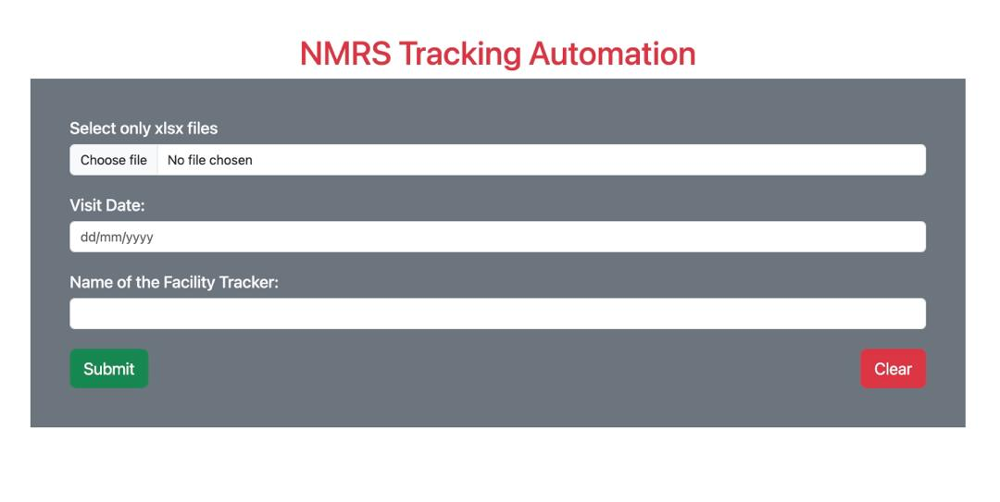

# NMRS CLIENT VERIFICATION/ TRACKING OUTCOME PROCESSOR

## Project Description
This Python App is used is an Automation Project Resposible for the processing the Client Verification Tracker Outcome on the EMR. This Project Reads an Excel File, cleans it up output and maps it to the respective concepts on the EMR.




## Prerequisites

- Python 3.8 or higher
- pip (Python package manager)
- Git

## Installation Guide

### Step 1: Clone the Repository

Clone the project repository from GitHub to your local machine:

```bash
git clone https://github.com/nelson-ust/nmrs_tracking_automator.git
cd nmrs_tracking_automator
```

### Step 2: Set Up a Virtual Environment
Creating a virtual environment is recommended to manage your Python dependencies:

```bash
python -m venv venv
```

Activate the virtual environment:

On Windows:

```bash
venv\Scripts\activate
```
On macOS and Linux:

```bash
source venv/bin/activate
```
### Step 3: Install Dependencies
Install the required Python packages using pip:

```bash
pip install -r requirements.txt
```
### Step 4: Run the Application
Start the FastAPI server using Uvicorn:

```bash
uvicorn api:app --reload
```
### Step 5: Access the Application
Open a web browser and navigate to http://localhost:8000. You should see the FastAPI application running.

Access the API documentation at http://localhost:8000/docs to interact with the API.

## Troubleshooting

If you encounter any issues, ensure you have the correct versions of Python and pip installed.